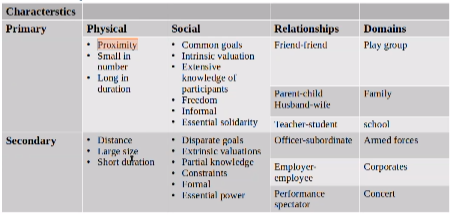

# Social Groups, Networks and Codes
The characteristic features of social relationships and social groups divide them into primary and secondary ones.  

Social networks are another notion that describes how and on what occasion individuals interact with each other. They may be divided into dense and loose networks, or multiplex and simplex networks.  

An individual plays many roles in society, participating in many different networks. The set of language norms associated with a certain role is called a code. The set of all codes an individual has is called their repertoire.
